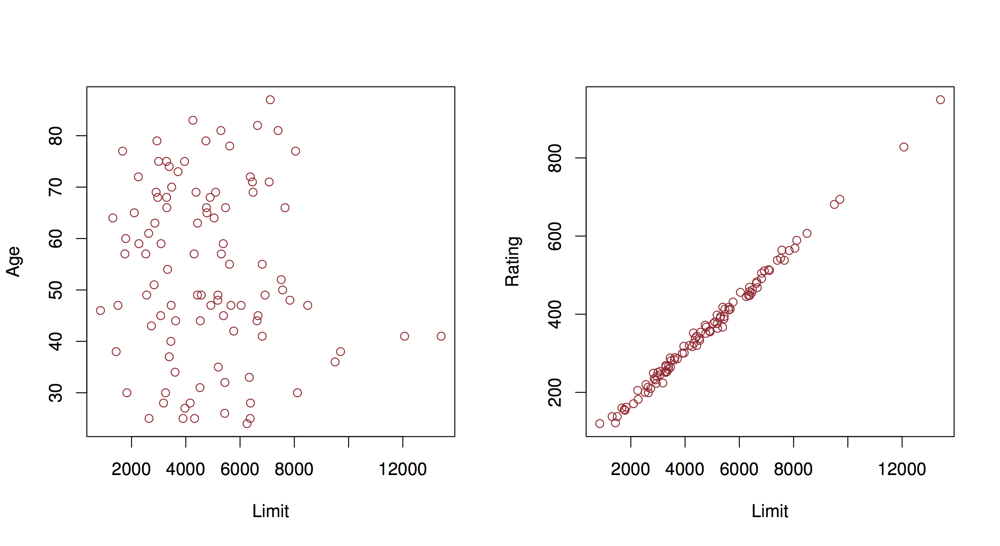

```{r setup, include=FALSE}
options(htmltools.dir.version = FALSE)
```

# Introduction to tidy regression analysis

Linear regression is a very elegant, simple, powerful and commonly used technique for data analysis. 

Let's start with the simplest linear model.

---

## Simple Regression

Analyze the relationship between 

- _continuous numerical_ variable $Y$ and 
- another (_numerical_ or _categorical_) variable $X$. 

We assume that in our population of interest the relationship between the two is given by a linear function:

$$
Y = \beta_0 + \beta_1 X
$$
---

## Simple Linear Regression

Here is data measuring characteristics of cars, including horsepower, weight, displacement, miles per gallon. We want to see the relationship between weight and miles per gallon


```{r, warning=FALSE, message=FALSE, echo=FALSE, fig.height=5}

library(ISLR)
library(dplyr)
library(ggplot2)
library(broom)

data(Auto)

Auto %>%
  ggplot(aes(x=weight, y=mpg)) +
    geom_point() + 
    geom_smooth(method=lm) + 
    theme_minimal()
```

---

## Simple Regression

Here we consider the model $\mathtt{mpg} = \beta_0 + \beta_1 \mathtt{weight}$.

We would say that we _regress_ `mpg` on `weight` when we perform this regression analysis. 

As before, given data we would like to estimate what this relationship is in the _population_ (what is the population in this case?). 

What do we need to estimate in this case? Values for $\beta_0$ and $\beta_1$. 

```{r, fig.height=4, echo=FALSE}
Auto %>%
  ggplot(aes(x=weight, y=mpg)) +
    geom_point() + 
    geom_smooth(method=lm) + 
    theme_minimal()
```

---

## Simple Regression

In R, linear models are built using the `lm` function

```{r}
auto_fit <- lm(mpg~weight, data=Auto)
auto_fit
```

This states that for this dataset $\hat{\beta}_0 = `r auto_fit$coef[1]`$ and $\hat{\beta}_1 = `r auto_fit$coef[2]`$. What's the interpretation?

---

## Simple Regression

```{r, echo=FALSE}
auto_fit
```

According to this model:

- a weightless car (i.e. `weight=0`) would run $\approx `r round(auto_fit$coef[1], 2)`$ _miles per gallon_ on average, and, 

- on average, a car would run $\approx `r -round(auto_fit$coef[2],3)`$ _miles per gallon_ fewer for every extra _pound_ of weight. 

Note, that the units of the outcome $Y$ and the predictor $X$ matter for the interpretation of these values.

---

## Inference

Now that we have an estimate, we want to know how good of an estimate this is. 

An important point to understand is that like the sample mean, the regression line we learn from a specific dataset is an estimate. 

A different sample from the same population would give us a different estimate (regression line). 

---

## Inference

But, statistical theory tells us that, 

- on average, we are close to population regression line (I.e., close to $\beta_0$ and $\beta_1$), 

- the spread around $\beta_0$ and $\beta_1$ is well approximated by a normal distribution and 

- that the spread goes to zero as the sample size increases.


---

### Confidence Interval

We can construct a confidence interval to say how precise we think our estimates of the population regression line is. 

In particular, we want to see how precise our estimate of $\beta_1$ is, since that captures the relationship between the two variables. 

```{r}
auto_fit_stats <- auto_fit %>%
  tidy() %>%
  select(term, estimate, std.error)
auto_fit_stats
```

This `tidy` function is defined by the `broom` package, which is very handy to manipulate the result of learning models in a consistent manner. 
---

## Confidence Interval

```{r, echo=FALSE}
auto_fit_stats
```

```{r, echo=FALSE}
confidence_interval_offset <- 1.95 * auto_fit_stats$std.error[2]
confidence_interval <- round(c(auto_fit_stats$estimate[2] - confidence_interval_offset,
                               auto_fit_stats$estimate[2],
                               auto_fit_stats$estimate[2] + confidence_interval_offset), 4)
```

For this model we would write, "on average, a car runs $_{`r confidence_interval[1]`} `r confidence_interval[2]`_{`r confidence_interval[3]`}$ _miles per gallon_ fewer per pound of weight".

---

### The $t$-statistic and the $t$-distribution

We can also test a null hypothesis about this relationship: 

_there is no relationship between weight and miles per gallon_, this translates to $\beta_1=0$. 

According to the statistical theory if this hypothesis is true then the distribution of $\hat{\beta}_1$ is well approximated by $N(0,\mathrm{se}(\hat{\beta}_1))$, 

if we observe the estimated $\hat{\beta}_1$ is _too far_ from 0 according to this distribution then we _reject_ the hypothesis.

---

### The $t$-statistic and the $t$-distribution

In practice, the $t$ distribution is used in this testing situation to obtain the probability of rejecting the null hypothesis. It is based on the $t$-statistic

$$
\frac{\hat{\beta}_1}{\mathrm{se}(\hat{\beta}_1)}
$$

You can think of this as a _signal-to-noise_ ratio, or a standardizing transformation on the estimated parameter. 

Under the null hypothesis, the $t$-statistic is well approximated by a $t$-distribution with $n-2$ _degrees of freedom_ (we will get back to _degrees of freedom_ shortly). 

---
### The $t$-statistic and the $t$-distribution

In our example, we get a $t$ statistic and P-value as follows:

```{r}
auto_fit_stats <- auto_fit %>%
  tidy()
auto_fit_stats
```

We would write: "We found a statistically significant relationship between weight and miles per gallon. On average, a car runs $_{`r confidence_interval[1]`} `r confidence_interval[2]`_{`r confidence_interval[3]`}$ _miles per gallon_ fewer per pound of weight ( $t$=`r round(auto_fit_stats$statistic[2],2)`, $p$-value < $`r signif(auto_fit_stats$p.value[2],3)`$)."

---

### Global Fit

We can make _predictions_ based on our regression model, and that prediction should be better than a prediction with a simple average. 

We can use this comparison as a measure of how good of a job we are doing using our model to fit this data: how much of the variance of $Y$ can we _explain_ with our model. 
---

## Global Fit

To do this we can calculate _total sum of squares_: 

$$
TSS = \sum_i (y_i - \overline{y})^2
$$

(this is the squared error of a prediction using the sample mean of $Y$)

and the _residual sum of squares_:

$$
RSS = \sum_i (y_i - \hat{y}_i)^2
$$

(which is the squared error of a prediction using the linear model we learned)

---

## Global Fit

The commonly used $R^2$ measure compares these two quantities:

$$
R^2 = \frac{\mathrm{TSS}-\mathrm{RSS}}{\mathrm{TSS}} = 1 - \frac{\mathrm{RSS}}{\mathrm{TSS}}
$$

These types of global statistics for the linear model can be obtained using the `glance` function in the `broom` package. In our example

```{r}
auto_fit %>%
  glance() %>%
  select(r.squared, sigma, statistic, df, p.value)
```

We will explain the the columns `statistic`, `df` and `p.value` when we discuss regression using more than a single predictor $X$.

---

## Issues with linear regression

There are some assumptions underlying the inferences and predictions we make using linear regression that we should verify are met when we use this framework. Let's start with a few important ones that apply to simple regression

---

### Non-linearity of outcome-predictor relationship

What if the underlying relationship is not linear?We can use exploratory visual analysis to do this by plotting residuals $(y_i - \hat{y}_i)^2$ as a function of the fitted values $\hat{y}_i$. 

The `broom` package uses the `augment` function to help with this task. It augments the input data used to learn the linear model with information of the fitted model for each observation

```{r}
augmented_auto <- auto_fit %>%
  augment()
augmented_auto %>% head()
```
---

### Non-linearity of outcome-predictor relationship

With that we can make the plot we need to check for possible non-linearity

```{r, message=FALSE, fig.height=4}
augmented_auto %>%
  ggplot(aes(x=.fitted,y=.resid)) +
    geom_point() + 
    geom_smooth() +
    labs(x="fitted", y="residual")
```

---

## Multivariate Regression

Now that we've seen regression using a single predictor we'll move on to regression using multiple predictors.
In this case, we use models of conditional expectation represented as linear functions of multiple variables.

---

## Multiple Regression

In our car example, this would be a model of the type:

$$
\mathtt{mpg} = \beta_0 + \beta_1 \times \mathtt{weight} + \beta_2 \times \mathtt{cylinders} + \beta_3 \times \mathtt{horsepower}
$$

These models let us make statements of the type: "holding everything else constant, miles per gallon decreased on average by 5 miles per cylinder added to the engine" (this would be given by parameter $\beta_2$ in the example model).

---

### Estimation in multivariate regression

We can build a model for miles per gallon using multiple predictors:

```{r, echo=FALSE, message=FALSE}
library(ISLR)
data(Auto)

library(dplyr)
library(broom)
library(ggplot2)
```

```{r}
auto_fit <- lm(mpg~1+weight+cylinders+horsepower+displacement+year, data=Auto)
auto_fit
```

From this model we can make the statement: "Holding everything else constant, cars run 0.76 miles per gallon more each year on average".

---

### Statistical statements (cont'd)

Like simple linear regression, we can construct confidence intervals, and test a null hypothesis of no relationship ($\beta_j=0$) for the parameter corresponding to each predictor. This is again nicely managed by the `broom` package:

```{r}
auto_fit_stats <- auto_fit %>%
  tidy()
auto_fit_stats
```

---

### Inference

```{r, echo=FALSE}
auto_fit_stats
```


```{r, echo=FALSE}

print_confint <- function(fit_df, term, digits=2) {
  i <- match(term, fit_df$term)
  confint_offset <- 1.95 * fit_df$std.error[i]
  confint <- round(c(fit_df$estimate[i] - confint_offset,
                     fit_df$estimate[i],
                     fit_df$estimate[i] + confint_offset), digits)
  paste0("{}_{", confint[1], "} ", confint[2], "_{", confint[3], "}")
}

print_pval <- function(fit_df, term) {
  i <- match(term, fit_df$term)
  pval <- fit_df$p.value[i]
  out <- ifelse(pval<1e-16, "<1e-16", paste0("=", signif(pval,4)))
  out
}
```

In this case we would reject the null hypothesis of no relationship only for predictors `weight` and `year`. We would write the statement for year as follows:

"Holding everything else constant, cars run $`r auto_fit_stats %>% print_confint("year")`$ miles per gallon more each year on average (P-value$`r auto_fit_stats %>% print_pval("year")`$)".

---

### The F-test

We can make additional statements for multivariate regression: "is there a relationship between _any_ of the predictors and the response?". Mathematically, we write this as $\beta_1 = \beta_2 = \cdots = \beta_p = 0$.

Under the null, our model for $y$ would be estimated by the sample mean $\overline{y}$, and the error for that estimate is by total sum of squared error $TSS$. As before, we can compare this to the residual sum of squared error $RSS$ using the $F$ statistic:

$$
\frac{(\mathrm{TSS}-\mathrm{RSS})/p}{\mathrm{RSS}/(n-p-1)}
$$

---

## The F-test

If this statistic is greater (enough) than 1, then we reject hypothesis that there is no relationship between response and predictors. 

Back to our example, we use the `glance` function to compute this type of summary:

```{r}
auto_fit %>% 
  glance() %>%
  select(r.squared, sigma, statistic, df, p.value)
```

In comparison with the linear model only using `weight`, this multivariate model explains _more of the variance_ of `mpg`, but using more predictors. This is where the notion of _degrees of freedom_ comes in: we now have a model with expanded _representational_ ability. 

---

## The F-test

However, the bigger the model, we are conditioning more and more, and intuitively, given a fixed dataset, have fewer data points to estimate conditional expectation for each value of the predictors. That means, that are estimated conditional expectation is less _precise_.

To capture this phenomenon, we want statistics that tradeoff how well the model fits the data, and the "complexity" of the model. Now, we can look at the full output of the `glance` function:

```{r}
auto_fit %>%
  glance() 
```

Columns `AIC` and `BIC` display statistics that penalize model fit with model size. The smaller this value, the better. 

---

## Model Comparison

Let's now compare a model only using `weight`, a model only using `weight` and `year` and the full multiple regression model we saw before.

```{r}
lm(mpg~weight, data=Auto) %>%
  glance()
```

```{r}
lm(mpg~weight+year, data=Auto) %>%
  glance()
```

In this case, using more predictors beyond `weight` and `year` doesn't help.

---

## Additional issues with linear regression

We saw previously some issues with linear regression that we should take into account when using this method for modeling. Multiple linear regression introduces an additional issue that is extremely important to consider when interpreting the results of these analyses: collinearity.



---

## Collinearity

In this example, you have two predictors that are very closely related. In that case, the set of $\beta$'s that minimize RSS may not be unique, and therefore our interpretation is invalid. You can identify this potential problem by regressing predictors onto each other. The usual solution is to fit models only including one of the colinear variables.


