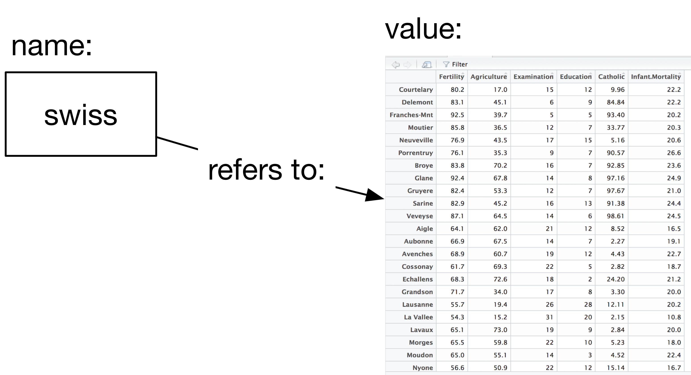

```{r setup, include=FALSE}
options(htmltools.dir.version = FALSE)
```

# Setting up

- R: https://cran.r-project.org/index.html
- Rstudio: https://www.rstudio.com/products/rstudio/download/

---

# A tour of Rstudio

DEMO

---

### Names, values and functions

In the console, we've now written a few instructions, e.g. `View(swiss)`. 

_expressions_: first of all, we call these instructions _expressions_, which are just text that R can evaluate into a value. `View(swiss)` is an expression.

_values_: so, what's a value? They are numbers, strings, data frames, etc. This is the data we will be working with. The number `2` is a value. So is the string `"Hector"`. 

So, what value is produced when R evaluates the expression `View(swiss)`? Nothing, which we also treat as a value. That wasn't very interesting, but it does have a side effect: it shows the `swiss` dataset in the Data viewer. 


---

## Names, values and functions

How about a simpler expression: `swiss`, what value is produced when R evaluates the expression `swiss`? 

_names_: so if `swiss` isn't a value, what is it? It is a _name_. We use these to refer to values. So, when we write the expression `swiss`, we tell R we want the _value_ referenced by the name `swiss`, that is, the data itself!



---

## Names, values and functions

_functions_: Besides numbers, strings, data frames, etc. another important type of value is the _function_.

Functions are a series of instructions that take some input value and produce a different value.  

Functions are called using the parentheses we saw before: `View(swiss)`, the parentheses say that you are passing input `swiss` to the function `View`. 

We'll see later how we can write our own functions.

---

## Packages

Install the following additional packages which we will use later on: `rvest`, `stringr`, `nycflights13` and `broom`.

